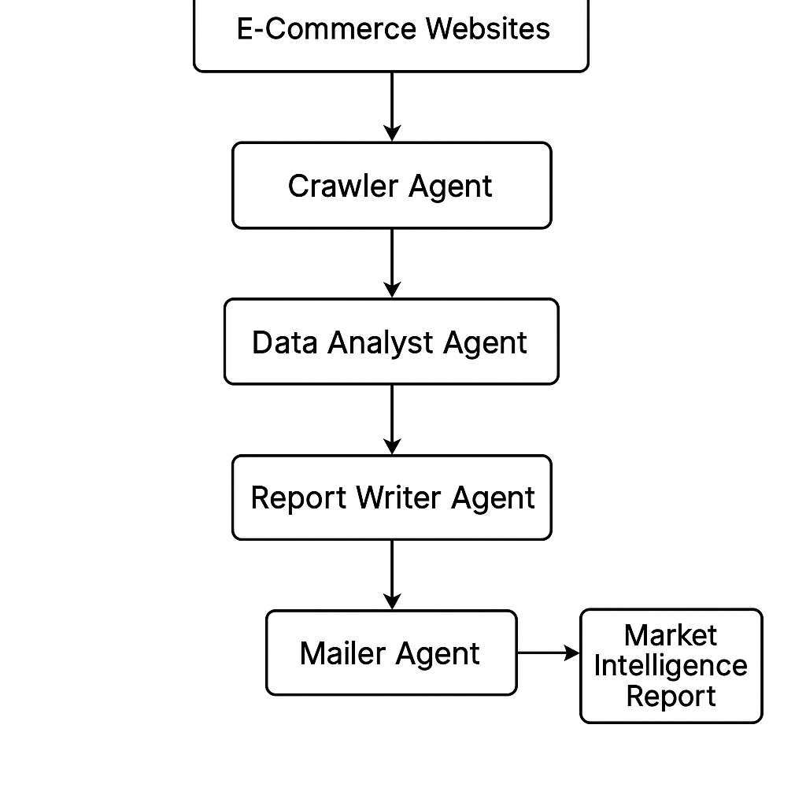

# Automated Market Research Agent Crew

## Problem Statement
A startup wants to analyze competitors' pricing and product offerings from multiple e-commerce websites (like Amazon, eBay, Walmart), summarize key insights, and email a daily market intelligence report.

## Goals
1. Crawl selected product pages (ex: laptops).
2. Extract product names, prices, ratings.
3. Compare findings across platforms.
4. Summarize insights into a human-readable report.
5. Send email report to a stakeholder.

## Strategy
### crewAI Strategy

We’ll build a crew of agents that divide the tasks:
* Crawler Agent – Visits URLs and extracts data.
* Data Analyst Agent – Compares and analyzes competitor offerings.
* Report Writer Agent – Summarizes the insights.
* Mailer Agent – Sends the report via email.

## Architecture Diagram


## Agent Collaboration Flow:
``` css
[CrawlerAgent] → [AnalystAgent] → [ReportAgent] → [MailerAgent]
```

## Code: crewAI Market Research Team
``` python
# main.py
from crewai import Crew, Agent, Task
from tools.web_scraper import WebScraperTool
from tools.report_emailer import EmailTool
from langchain.llms import OpenAI

llm = OpenAI(temperature=0.2)

# Tools
scraper_tool = WebScraperTool()
email_tool = EmailTool()

# Agents
crawler = Agent(
    role="Web Crawler",
    goal="Extract product data from e-commerce sites",
    backstory="Expert in scraping online retail platforms to gather pricing and product information.",
    tools=[scraper_tool],
    llm=llm,
    allow_delegation=False,
)

analyst = Agent(
    role="Market Analyst",
    goal="Analyze competitor pricing and product differences",
    backstory="Data-driven analyst with experience in e-commerce market trends.",
    llm=llm
)

report_writer = Agent(
    role="Business Writer",
    goal="Write an executive summary of market insights",
    backstory="Specialist in generating business reports with clear insights and recommendations.",
    llm=llm
)

mailer = Agent(
    role="Email Automation Agent",
    goal="Send the market research report to stakeholders",
    backstory="Email bot that ensures timely delivery of reports to decision makers.",
    tools=[email_tool],
    llm=llm
)

# Tasks
task1 = Task(
    description="Scrape laptop product details (name, price, rating) from Amazon, eBay, and Walmart.",
    expected_output="Structured JSON with product info from each site.",
    agent=crawler
)

task2 = Task(
    description="Analyze the pricing trends, product variations, and key competitor strategies.",
    expected_output="Bullet point insights comparing platforms, identifying best deals, price differences.",
    agent=analyst
)

task3 = Task(
    description="Create a human-readable market intelligence summary based on the analysis.",
    expected_output="A one-page report highlighting main takeaways.",
    agent=report_writer
)

task4 = Task(
    description="Email the final report to 'marketintel@startup.com'",
    expected_output="Confirmation message of successful email sent.",
    agent=mailer
)

# Crew
crew = Crew(
    agents=[crawler, analyst, report_writer, mailer],
    tasks=[task1, task2, task3, task4],
    verbose=True
)

crew.kickoff()

```
## Custom Tools
### **tools/web_scraper.py** (simple template using BeautifulSoup or Playwright)
``` python
from crewai_tools import BaseTool
import requests
from bs4 import BeautifulSoup

class WebScraperTool(BaseTool):
    name = "WebScraperTool"
    description = "Scrapes product info from a given URL"

    def _run(self, url: str) -> str:
        response = requests.get(url)
        soup = BeautifulSoup(response.text, "html.parser")
        # Example: extract all product names and prices
        products = []
        for item in soup.select(".product-tile"):
            name = item.select_one(".product-title").text.strip()
            price = item.select_one(".price").text.strip()
            products.append({"name": name, "price": price})
        return str(products)
```
### **tools/report_emailer.py** 
``` python
from crewai_tools import BaseTool
import smtplib
from email.message import EmailMessage

class EmailTool(BaseTool):
    name = "EmailTool"
    description = "Sends reports via email"

    def _run(self, report: str) -> str:
        msg = EmailMessage()
        msg.set_content(report)
        msg["Subject"] = "Daily Market Intelligence Report"
        msg["From"] = "reportbot@yourstartup.com"
        msg["To"] = "marketintel@startup.com"

        with smtplib.SMTP("smtp.yourmail.com", 587) as server:
            server.starttls()
            server.login("reportbot@yourstartup.com", "password")
            server.send_message(msg)
        
        return "Email sent successfully!"
```
## Realworld Impact
* Automates time-consuming market research
* Improves competitive intelligence with daily updates
* Empowers stakeholders with actionable insights

## Expansion Ideas:
* Add sentiment analysis of customer reviews.
* Integrate a dashboard for visual insights.
* Use memory tools for week-over-week comparisons.


